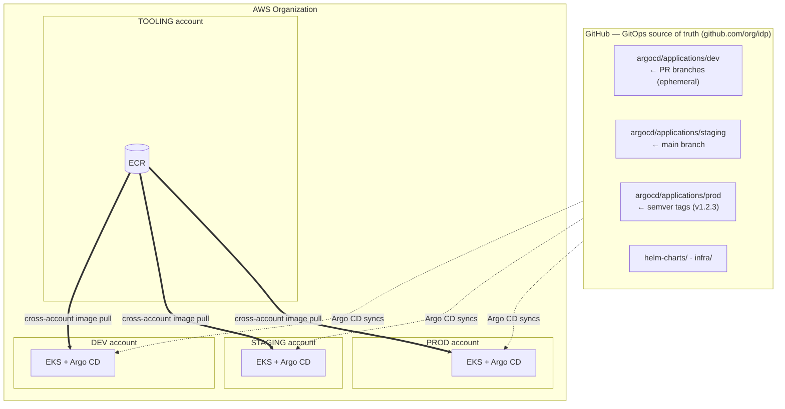
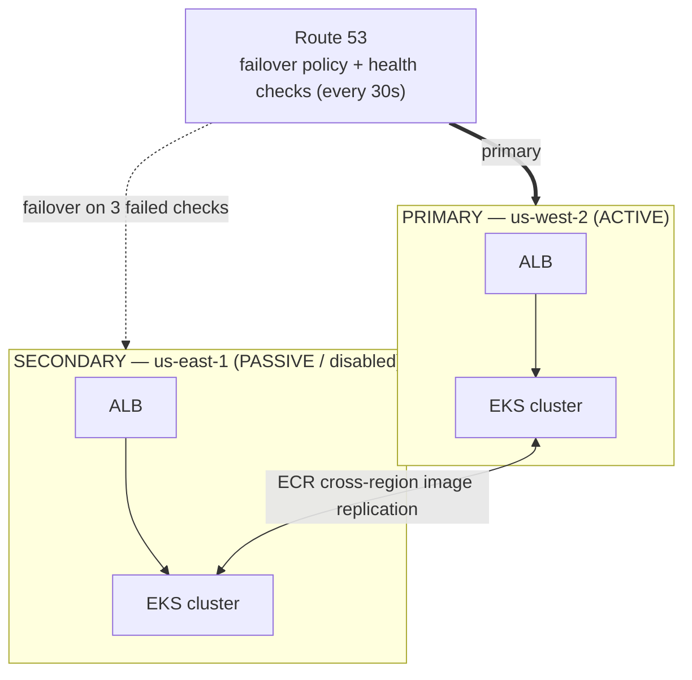
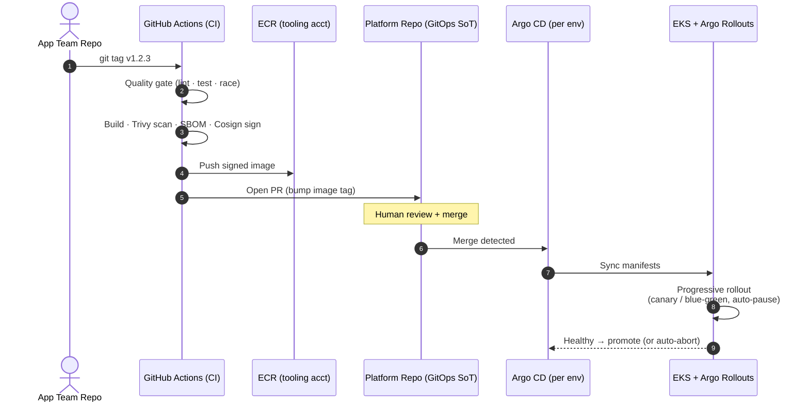
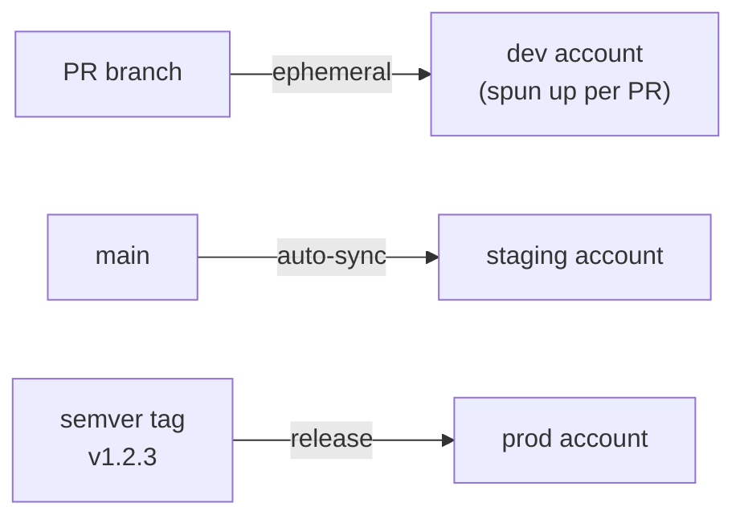
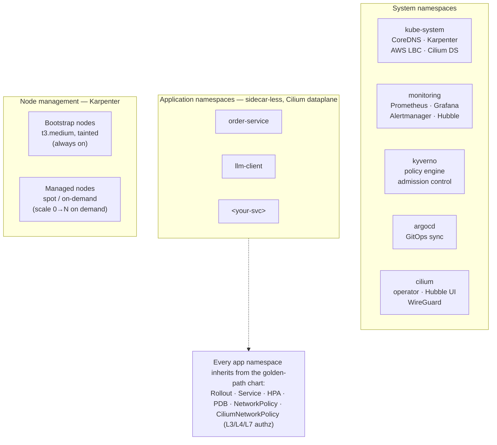
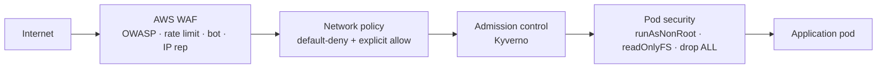
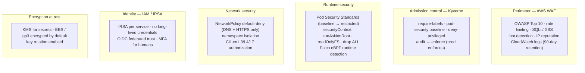
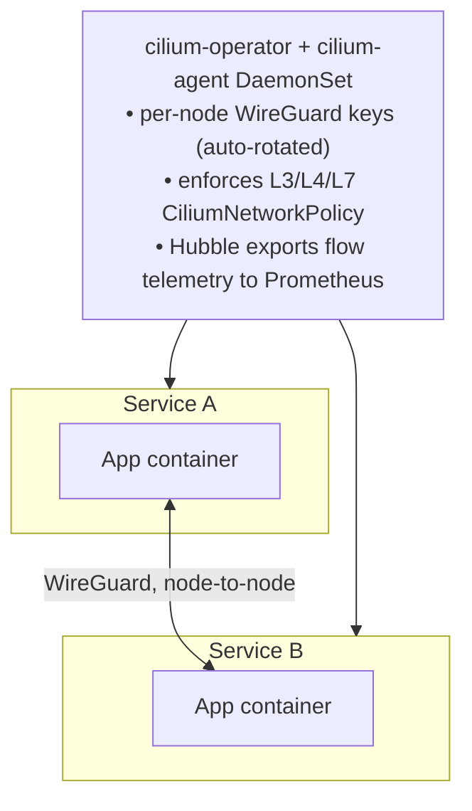
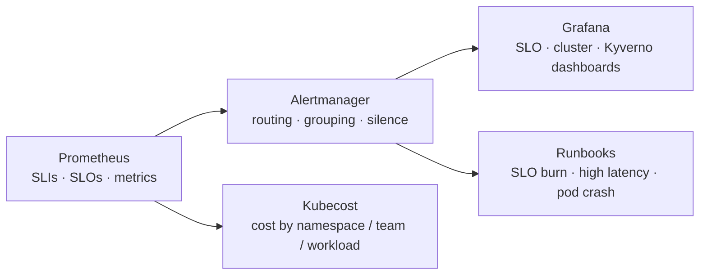

# IDP Architecture

## High-Level Overview

## Multi-Region Disaster Recovery (Active-Passive)

> **Status: scaffolded but disabled.** The secondary region's config and the `dns-failover` module exist but are not wired into `infra/entry/main.tf` and no workflow provisions them. The design below is what turning it on yields.

**Failover time** ≈ 2–3 min = 3 consecutive failed health checks (~90s) + DNS TTL.

**Recovery:** fix the primary → health checks pass → Route 53 marks PRIMARY healthy → traffic returns automatically.

## Deployment Flow

A change starts in an app team's own repo and reaches production without the developer
touching Kubernetes, Terraform, or this repo by hand. CI is the only writer to the GitOps
source of truth; Argo CD is the only writer to the cluster.

### Environment promotion

The same artifact is promoted across environments by **what git ref points at it** — no rebuilds.

## EKS Cluster Components

## Security Architecture

**Defense in depth** — a request crosses four enforcement points before reaching application code:

The control domains behind those points:

### Cilium dataplane — WireGuard encryption in transit

Compliance controls satisfied by this layer:

- **PCI-DSS 4.0 §4.2.1** — strong cryptography for data in transit
- **SOC 2 CC6.1** — logical access controls (CiliumNetworkPolicy)
- **HIPAA §164.312(e)** — transmission security
- **FedRAMP SC-8** — transmission confidentiality
- **Zero-trust** — default-deny + explicit identity-based allows

### Image security & supply chain

- Trivy vulnerability scanning in CI — **CRITICAL findings block the deployment**
- Cosign keyless signing + CycloneDX SBOM attestation
- ECR cross-account pull with organization check
- Immutable image tags

## Observability Stack

